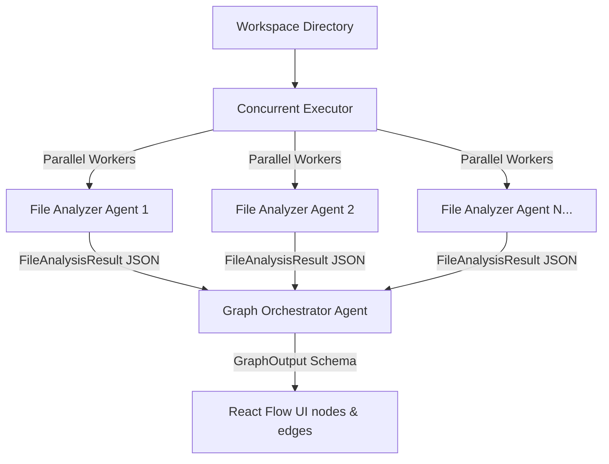

# 🗺️ RepoGraph AI

**RepoGraph AI** is a next-generation repository architecture visualizer and autonomous developer cockpit powered by **Gemini 3.5 Flash**. It maps, audits, refactors, and secures your codebase by substituting static AST parses with a collaborative team of parallelized Gemini agents communicating over strict typed Pydantic contracts.

---

## 🏗️ Core Architecture & Agent Layout



1. **Parallel File Analyzer Agents**:
   - Spawns concurrent `gemini-3.5-flash` requests (up to 10 workers in a `ThreadPoolExecutor`) to scan individual source files.
   - Workers semantically extract definitions (classes, functions), imports, technologies, and classifications using a Pydantic `FileAnalysisResult` response schema.
2. **Graph Orchestrator Agent**:
   - Aggregates worker scans to dynamically map imports, route handlers (`defines` relationship), and client requests (`calls` relationship), compiling a complete visual ReactFlow graph.
3. **Local AST Fallback**:
   - Automatically falls back to localized AST and regex scanners when the Gemini API key is absent, ensuring offline reliability during presentations.

---

## 🛡️ Tri-Agent Developer Suite

### 1. 🛡️ ArchGuard CI Gate Agent
- **Objective**: Evaluates architectural compliance and regression metrics across branch changes.
- **How it works**: Compares the base master/main branch structure against incoming branch modifications. Evaluates circular dependencies and SOLID SRP routing rules.
- **Visuals**: Displays a rolling CI system terminal log, alongside a green **PASSED** or red **FAILED** gate indicator.

### 2. 📐 Multimodal Spec-to-Reality Validator
- **Objective**: Uses **Gemini Multimodal Vision** to compare visual design diagrams directly against implemented codebase routes.
- **How it works**: Engineers upload a hand-drawn or Excalidraw block diagram `.png`/`.jpg` file alongside a specification text. The backend feeds the raw bytes directly to Gemini 3.5 to evaluate alignment, score drift (0-100), and highlight remedies.

### 3. 🕒 Time-Travel Git Historian Scrubber
- **Objective**: Scrubs through repository commit logs to compile architectural evolution narration details.
- **How it works**: Drag the scrubber slider at the bottom of the canvas to check out commits temporarily in the workspace, map graph components, and prompt the AI Historian to narrate what structural design improvements or regressions were introduced in each commit.

---

## 🛡️ Multi-Gate Self-Verifying PR Pipeline

LLMs are confident even when wrong. RepoGraph AI doesn't trust the model's confidence—it trusts the compiler, the static analyzer, and the graph dependency models. When using the **AI Agent Tab** to generate code refactors, the Coder output undergoes a strict **4-Gate Verification Pipeline**:

```
Agent Generates Code
         ↓
[Gate 1: Correctness] AST parse + compiler syntax checks (python -m py_compile)
         ↓
[Gate 2: Safety] Downstream Blast Radius mapping + DFS Circular Dependency cycle checks
         ↓
[Gate 3: Security] Static scans checking dynamic eval (CWE-95), SQLi (CWE-89), and secret leaks (CWE-798)
         ↓
[Gate 4: Adversarial Critic] Reviews diff structures against initial architectural intentions
         ↓
       ✅ PR proposed with structured Verification Audit Table
```

### 🔘 PR Verification Audit Table Example:

| Gate | Verification Aspect | Status | Result/Details |
| :--- | :--- | :--- | :--- |
| 1 | **Correctness AST/Compiler** | 🟢 PASSED | AST & Compiler syntax verified |
| 2 | **Architectural Safety** | 🟢 PASSED | Blast radius: 2 dependents. No cycles. |
| 3 | **CWE Static Security Scan** | 🟢 PASSED | No Dynamic Eval/SQLi/Credential leaks |
| 4 | **Adversarial Critic Review** | 🟢 PASSED | Intended plan matches generated file diff |

---

## 🔌 Model Context Protocol (MCP) Integration

RepoGraph AI includes a built-in stdio **MCP Server** that exposes our entire agentic suite as tools for compatible IDEs (Cursor, Claude Desktop, VSCode).

### Launch the MCP Server
Run the stdio JSON-RPC server using Python:
```bash
python3 backend/mcp_server.py
```

### Exposed MCP Tools
1. `run_archguard_ci`: Run SOLID regression checks and branch structure comparisons.
2. `validate_spec`: Audit codebase graphs against architectural specifications and design rules.
3. `time_travel`: Map repository code components and generate narrated evolution summaries at a specific commit.
4. `codebase_agent_fix`: Launch the autonomous multi-agent developer team to refactor codebase violations.
5. `codebase_tour_guide`: Trace call dependencies and answer codebase onboarding questions agentically.
6. `agentic_solid_audit`: Run deep Gemini-driven SOLID principles architectural health audits.

---

## ⚡ Gemini Parallel Tool Calling

Demonstrating Gemini's state-of-the-art parallel function calling support, the orchestrator script runs compound natural language commands by triggering multiple agent workflows concurrently.

### Run Parallel Orchestrator CLI
```bash
python3 backend/parallel_orchestrator.py "Run CI checks and validate if main.py is decoupled from models"
```
Under the hood, Gemini generates concurrent function call suggestions in a single turn, which the Python `ThreadPoolExecutor` runs in parallel before returning synthesized results back to Gemini for compiling a cohesive system report.

---

## 🚀 Quick Start & Launching

You can run both the frontend and backend servers concurrently using the provided startup scripts:

### 1. Start both servers
To install dependencies (if not already installed) and launch the application:
```bash
./run.sh
```

### 2. Restart/Reset servers
If you need to force-restart the servers or free up ports 8000 and 5173:
```bash
./restart.sh
```

*The **Backend** FastAPI server will run on [http://localhost:8000](http://localhost:8000) and the **Frontend** Vite web app on [http://localhost:5173](http://localhost:5173).*
